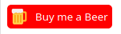

# Donate Button Component for Vue




## Project setup
```
# at first you need a .env File in your Main Project
# add these two lines with your datas:

VUE_APP_BTNTEXT=Buy me a Beer
VUE_APP_BTNVALUE=DU38SPUBF4ZYS

```
then you must add the Project in your Dependencies: 
```
 "dependencies": {
    ...
    "DonateButton": "git+https://github.com/d-schaffer/
    ...
  },
```


### Now you can import the Project in your maint.ts
```
...
import { DonatePlugin } from "DonateButton";
...
Vue.use(DonatePlugin);
...

```
Now you can use the Component in your whole Project

<small>Other Tools: 
https://password-organizer.com<br>
For Question feel free to contact me: dschaffer@icloud.com</small>


